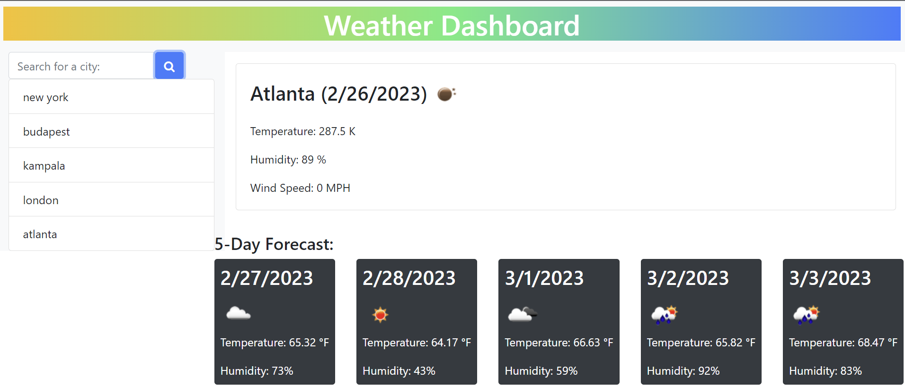

# weather-application-hw6
## Description
This is an app designed to display the weather in different cities around the world. It works by pulling data from the Open weather API. When a city is typed into the search bar, a call is made that translates it into longitude and latitude. The API has a range of information on the weather conditions and we decide what data we want to display on the page. In this case it was: wind speed, humidity and temperature.

link to deployed application:

## Contribution
N/A

## Liscense
MIT

## User story
AS A traveler
I WANT to see the weather outlook for multiple cities
SO THAT I can plan a trip accordingly

## Acceptance Criteria
GIVEN a weather dashboard with form inputs
WHEN I search for a city
THEN I am presented with current and future conditions for that city and that city is added to the search history
WHEN I view current weather conditions for that city
THEN I am presented with the city name, the date, an icon representation of weather conditions, the temperature, the humidity, and the wind speed
WHEN I view future weather conditions for that city
THEN I am presented with a 5-day forecast that displays the date, an icon representation of weather conditions, the temperature, the wind speed, and the humidity
WHEN I click on a city in the search history
THEN I am again presented with current and future conditions for that city

 ## screenshot
  